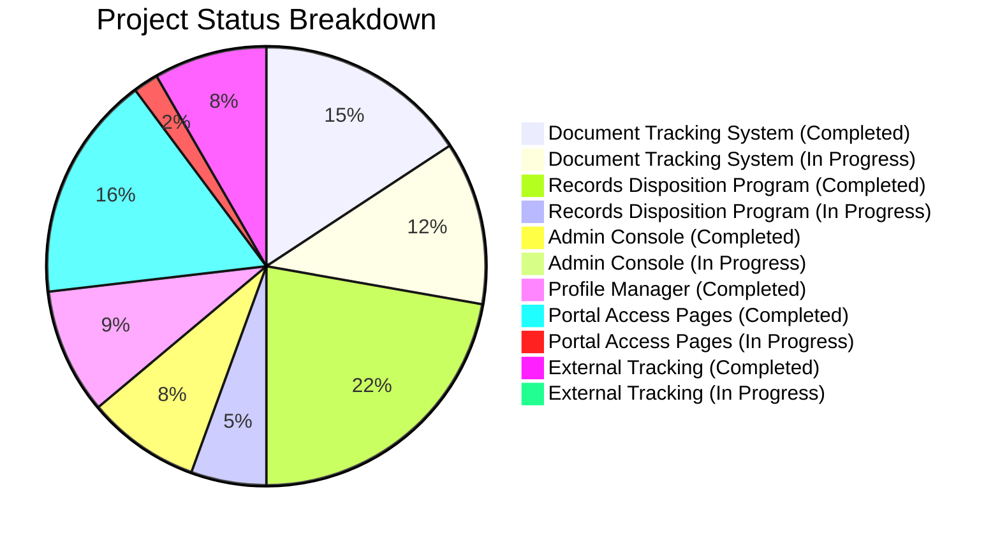
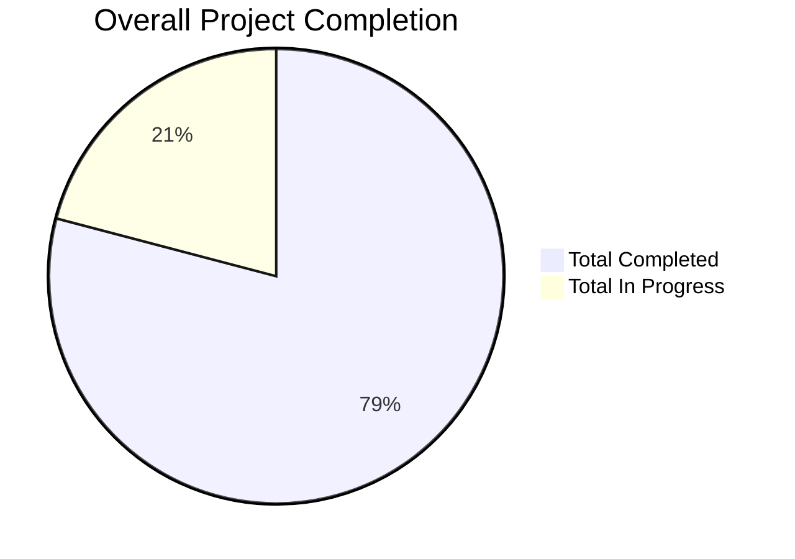

# RMS-CSPC
Records Management System Version 2 Development

This is the development repository for the **Records Management System (RMS) Version 2** for CSPC. The application is built using Laravel 13, Livewire, and is fully containerized with Docker.

---

## 🚀 Quick Start with Docker

The entire stack (PHP/Laravel application, MySQL database, Node/Vite development server, and phpMyAdmin) is containerized. You do not need to install PHP, Composer, Node.js, or MySQL locally on your host machine.

### Prerequisites
- [Docker Desktop](https://www.docker.com/products/docker-desktop/) (includes Docker Compose)

### Setup & Running the Application

1. **Navigate to the application folder:**
   ```bash
   cd records-management-system
   ```

2. **Start the containers:**
   Run the following command to build the images and start the services:
   ```bash
   docker compose up --build
   ```
   *(Note: Add the `-d` flag if you want to run the containers in detached/background mode).*

3. **Database Migrations:**
   During startup, the container entrypoint script will automatically wait for the MySQL database to become healthy and then run migrations (`php artisan migrate --force`).

4. **Verify Application Key:**
   The `.env.docker` file contains a pre-configured `APP_KEY`. If you need to generate a new key or re-key the application, run:
   ```bash
   docker compose exec app php artisan key:generate
   ```

---

## 🌐 Services and Ports

Once the containers are running, the following services are available:

| Service | Host URL | Description |
| :--- | :--- | :--- |
| **Laravel App** | [http://localhost:49000](http://localhost:49000) | The main Records Management System application. |
| **phpMyAdmin** | [http://localhost:9000](http://localhost:9000) | Database management interface. |
| **Vite Dev Server** | [http://localhost:5173](http://localhost:5173) | Hot Module Replacement (HMR) for frontend assets. |
| **MySQL Database** | `localhost:3307` | Database server (mapped from port `3306` inside). |

---

## 🗄️ Database Connection Details

These details are defined in [records-management-system/.env.docker](file:////RMS-CSPC/records-management-system/.env.docker) and are used to connect to the database:

- **Host (from Host Machine):** `127.0.0.1` (Port: `3307`)
- **Host (from inside Docker App Container):** `db` (Port: `3306`)
- **Database Name:** `rms`
- **Username:** `adminrms`
- **Password:** `admin`
- **Root Password:** `MacCloud`

---

## 🛠️ Helpful Commands

Here are some common commands you can run while developing:

### Run Artisan Commands
To run any Artisan command inside the running application container:
```bash
docker compose exec app php artisan <command>
```
*Example (running seeders):*
```bash
docker compose exec app php artisan db:seed
```

### Stop the Application
To stop all running containers:
```bash
docker compose down
```

### Clean up Volumes
To stop containers and delete database and dependency volumes (warning: this resets database data):
```bash
docker compose down -v
```

---

## 📊 Project Status

We track the progress of different modules using the completion ratios below (the remaining ratio represents tasks in progress):



### Overall Completion Rate



---

## ✨ Recent Key Features & Improvements

- **RDP NAP Forms (Forms 1, 2 & 3):** Official report generation with office-based section dividers, print preview modals, and hierarchical record series rendering.
- **Granular Role Clearances:** Added 18 individual per-form RDP clearances for NAP Forms 1, 2, and 3 (`access`, `modify`, `print`, `view_others`, `edit_others`, `print_others`), with admin-only toggles defaulting to `false` for security.
- **Strict Document File Validation:** Enforced strict document-only upload restrictions (`.pdf`, `.doc`, `.docx`, `.xls`, `.xlsx`, `.ppt`, `.pptx`, `.txt`, `.csv`, `.rtf`, `.odt`, `.ods`) on RDP file upload pages.
- **Docker & Vite HMR Optimization:** Enhanced HMR performance and asset resolution in Docker environments.
- **Dashboard UI Enhancements:** Monochromatic blue color palette with fixed stat card flex alignment.

---

## 📁 Repository Structure

- [records-management-system/](file:////RMS-CSPC/records-management-system): Main Laravel & Livewire web application source code and Docker setup.
- [database.sql](file:////RMS-CSPC/database.sql): Database backup/reference schema structure.
- [Progress.txt](file:////RMS-CSPC/Progress.txt): Development progress notes and status of different modules.
