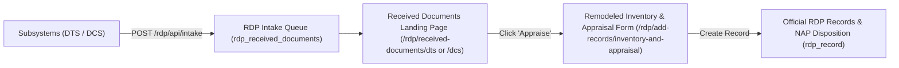

# How to Use the RDP Intake API (Records Disposition Program)

This guide explains how other subsystems—such as the **Document Tracking System (DTS)**, **Document Control System (DCS)**, or external modules—can integrate with the **Records Disposition Program (RDP)** using the RDP Intake API.

---

## 1. Overview & Architecture

When documents reach their retention milestone or completion of routing in other subsystems, they can be forwarded to RDP for **archival appraisal**, **inventory scheduling**, and **disposition compliance (NAP Form 1 / Form 2)**.



---

## 2. Authentication & CSRF Configuration

* **Authentication**: Requires a valid logged-in RMS session (`auth` middleware). Any authenticated user in the system (e.g., users in DTS, DCS, or Administration) can invoke the intake API.
* **CSRF Exemption**: `/rdp/api/*` and `/rdp/intake/*` are configured in `bootstrap/app.php` under `$middleware->validateCsrfTokens(except: [...])`, allowing standard JSON API `fetch()` and `XMLHttpRequest` requests without manual token handling.

---

## 3. API Endpoints Reference

### 3.1 Send / Intake Document to RDP

Creates an incoming document intake record in RDP and returns the URLs to either land on the queue or proceed immediately to the pre-filled appraisal form.

* **URL**: `POST /rdp/api/intake` *(Legacy alias: `POST /rdp/intake/send`)*
* **Headers**:
  * `Content-Type: application/json`
  * `Accept: application/json`

#### Request Parameters:

| Field | Type | Required | Description |
| :--- | :--- | :--- | :--- |
| `source_subsystem` | String | **Yes** | Originating system: `'DTS'`, `'DCS'`, or `'OTHER'` |
| `document_code` | String | **Yes** | Unique tracking or control number (e.g., `'DTS-2026-0042'`, `'CSPC-QM-01'`) |
| `document_title` | String | **Yes** | Title or subject of the document |
| `description` | String | No | Summary, transaction notes, or keyword details |
| `origin_office` | String | No | Office code or department name that originated the document |
| `target_office` | String | No | Destination office (if applicable) |
| `date_received` | Date | No | Format `YYYY-MM-DD` (defaults to today's date) |
| `file_path` | String | No | Relative or storage path to the document file |
| `file_name` | String | No | Display name of the uploaded document |
| `document_id_handler` | String | No | Storage ID or hash from `sys_document_data` |
| `metadata` | Object / JSON | No | Optional key-value object with extra subsystem data |

#### Example Request Payload:
```json
{
  "source_subsystem": "DTS",
  "document_code": "DTS-2026-0042",
  "document_title": "Project Proposal - Campus Network Modernization",
  "description": "Approved infrastructure upgrade proposal from ICT office.",
  "origin_office": "ICT",
  "target_office": "VPAA",
  "date_received": "2026-09-24",
  "document_id_handler": "DTS1727142000",
  "metadata": {
    "flow_code": "FLOW-01",
    "originator": "Director, ICT"
  }
}
```

#### Success Response (HTTP 200 - New Document):
```json
{
  "success": true,
  "already_sent": false,
  "message": "Document 'DTS-2026-0042' successfully sent to RDP!",
  "id": 3,
  "status": "pending",
  "landing_url": "http://your-domain.com/rdp/received-documents/dts",
  "appraise_url": "http://your-domain.com/rdp/add-records/inventory-and-appraisal?prefill_intake_id=3&prefill_source=DTS&prefill_code=DTS-2026-0042&prefill_title=Project%20Proposal...&prefill_date=2026-09-24&prefill_doc_id=DTS1727142000"
}
```

#### Duplicate Document Response (HTTP 200 - Already Sent):
If the document code has already been sent to RDP, the API detects it safely without throwing an error:
```json
{
  "success": true,
  "already_sent": true,
  "message": "Document 'DTS-2026-0042' is already in RDP intake.",
  "id": 3,
  "status": "pending",
  "landing_url": "http://your-domain.com/rdp/received-documents/dts",
  "appraise_url": "http://your-domain.com/rdp/add-records/inventory-and-appraisal?prefill_intake_id=3&..."
}
```

---

### 3.2 Check Document Status in RDP

Allows external subsystems to query the appraisal status of a document using its tracking or control number.

* **URL**: `GET /rdp/api/status/{document_code}`
* **Example**: `GET /rdp/api/status/DTS-2026-0042`
* **Headers**: `Accept: application/json`

#### Response (HTTP 200):
```json
{
  "found": true,
  "id": 3,
  "source_subsystem": "DTS",
  "document_code": "DTS-2026-0042",
  "document_title": "Project Proposal - Campus Network Modernization",
  "status": "appraised",
  "appraised_record_id": 48,
  "date_received": "2026-09-24",
  "created_at": "2026-09-24 04:47:50"
}
```

* Status values:
  * `"pending"`: Document received in RDP; awaiting appraisal.
  * `"appraised"`: Official record created in `rdp_record` (referenced by `appraised_record_id`).
  * `"dismissed"`: Document dismissed by records officer.

#### Not Found Response (HTTP 404):
```json
{
  "found": false,
  "message": "Document 'DTS-999' not found in RDP intake."
}
```

---

### 3.3 List / Query Received Documents

Fetch a paginated list of received documents with optional filters.

* **URL**: `GET /rdp/api/documents`
* **Query Parameters**:
  * `source` *(optional)*: Filter by subsystem (`'DTS'`, `'DCS'`).
  * `status` *(optional)*: Filter by status (`'pending'`, `'appraised'`, `'dismissed'`).
  * `search` *(optional)*: Text search matching code, title, or office.
  * `per_page` *(optional)*: Results per page (default: `20`).

#### Example:
```http
GET /rdp/api/documents?source=DTS&status=pending&per_page=10
```

---

## 4. Integration Examples

### 4.1 JavaScript / Frontend "Send to RDP" Button

Add this snippet to your Blade view or button click handler in DTS or DCS:

```html
<!-- Example Button -->
<button type="button" class="btn btn-primary" onclick="sendToRdp('DTS-2026-0042', 'Project Proposal', 'ICT')">
    Send to RDP
</button>

<script>
async function sendToRdp(controlNumber, title, officeCode) {
    try {
        const response = await fetch('/rdp/api/intake', {
            method: 'POST',
            headers: {
                'Content-Type': 'application/json',
                'Accept': 'application/json'
            },
            body: JSON.stringify({
                source_subsystem: 'DTS',
                document_code: controlNumber,
                document_title: title,
                origin_office: officeCode,
                date_received: new Date().toISOString().split('T')[0]
            })
        });

        const result = await response.json();

        if (result.success) {
            // Option A: Redirect user to the Received Documents landing page
            window.location.href = result.landing_url;

            // Option B: Or redirect directly into the pre-filled appraisal form:
            // window.location.href = result.appraise_url;
        } else {
            alert('Failed to send document to RDP: ' + (result.message || 'Unknown error'));
        }
    } catch (err) {
        console.error('Error sending document to RDP:', err);
    }
}
</script>
```

---

### 4.2 Laravel Backend / Livewire Controller

If you want to invoke the intake logic directly from a Livewire Component or Controller in PHP:

```php
use Illuminate\Support\Facades\Http;
use Illuminate\Support\Facades\DB;

public function forwardToRdp(string $controlNumber): void
{
    $transaction = DB::table('dts_transaction_details')
        ->where('control_number', $controlNumber)
        ->first();

    if (!$transaction) {
        session()->flash('error', 'Transaction not found.');
        return;
    }

    $response = Http::withHeaders([
        'Accept' => 'application/json',
    ])->post(url('/rdp/api/intake'), [
        'source_subsystem' => 'DTS',
        'document_code'    => $transaction->control_number,
        'document_title'   => $transaction->subject,
        'description'      => 'Forwarded from DTS for archival appraisal.',
        'origin_office'    => $transaction->originated_from,
        'date_received'    => now()->toDateString(),
    ]);

    if ($response->successful()) {
        $data = $response->json();
        // Redirect to RDP landing page:
        redirect()->to($data['landing_url']);
    }
}
```

---

## 5. What Happens After Calling the API?

1. **Intake Queueing**: The document immediately appears in RDP under **Received Documents**:
   * For DTS: `/rdp/received-documents/dts`
   * For DCS: `/rdp/received-documents/dcs`
2. **Appraisal Link**:
   * Records Officers see an **"Appraise"** button next to the document.
   * Clicking "Appraise" opens the remodeled **Inventory and Appraisal** form (`/rdp/add-records/inventory-and-appraisal`).
   * The form automatically pre-fills:
     * Series Title
     * Description
     * Date Covered
     * Duplicate / Copy Furnished Offices
     * Attachment file pointer
3. **Automatic Status Tracking**:
   * Once the Records Officer saves a draft or finalizes the record, the intake status automatically switches from `pending` to `appraised` and links to the generated `rdp_record.id`.
   * Calling `GET /rdp/api/status/{code}` will reflect this update immediately.

---

## 6. Summary of Routes

| Method | URI | Route Name | Middleware | Description |
| :--- | :--- | :--- | :--- | :--- |
| `POST` | `/rdp/api/intake` | `rdp.api.intake` | `auth` | Receive document from DTS / DCS into RDP |
| `POST` | `/rdp/intake/send` | `rdp.intake.send` | `auth` | Backward-compatible alias for `/rdp/api/intake` |
| `GET` | `/rdp/api/status/{code}` | `rdp.api.status` | `auth` | Check if document is pending or appraised |
| `GET` | `/rdp/api/documents` | `rdp.api.documents` | `auth` | List received documents with filters |
| `GET` | `/rdp/received-documents/dts` | `rdp.received-documents.dts` | `can.access.rdp` | DTS Intake Landing Page UI |
| `GET` | `/rdp/received-documents/dcs` | `rdp.received-documents.dcs` | `can.access.rdp` | DCS Intake Landing Page UI |
